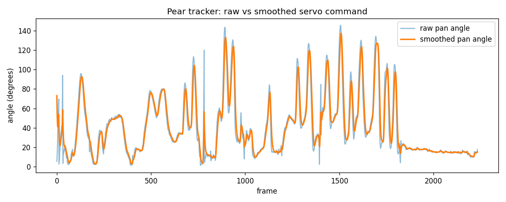
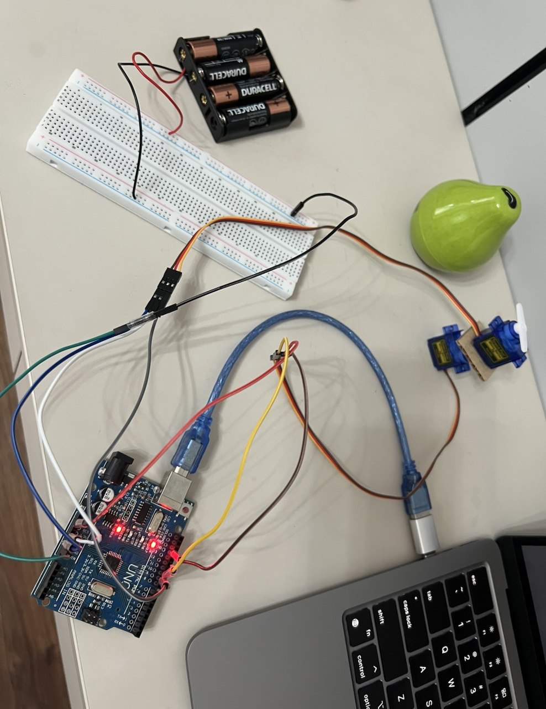

# Pan-Tilt Pear Tracker

A computer-vision pan-tilt camera rig — my first hardware build, end-to-end.
Built in 7 days as an ML engineer at Uztelecom who had never touched a microcontroller.

## What it does
A webcam detects a green ceramic pear in real time using OpenCV color segmentation
in HSV space. The pear's pixel position is mapped to servo angles, smoothed with
an exponential filter, and sent over USB serial to an Arduino Uno that drives two
SG90 servos as a pan-tilt mount. **Move the pear, the camera follows.**

It's the **sense → decide → actuate** loop, the fundamental loop every robot runs on.
My day job ends at "decide" — this project was about building the "actuate" half.

## How it works
The smoothing filter is the same idea I use at work for noisy time-series
forecasting — applied here to servo command signals instead.

## Hardware

- Arduino Uno R3 (SMD clone, CH340 USB chip)
- 2× SG90 micro servos (pan + tilt)
- MB-102 breadboard, Dupont jumper wires, breakaway pin headers
- 4×AA battery pack (separate supply for the servos)
- USB-C → USB-A OTG adapter + A-to-B cable (for M2 Mac)
- Pan-tilt structure: cardboard + tape
- Build cost: \~310,000 UZS (\~$25)

## What I actually ran into
- **Shipping is part of the build.** Ordered AA batteries, got AAA. Ordered an Arduino "with cable" — arrived without one. Bought a USB cable that turned out to be USB-A → USB-B and didn't fit my M2 Mac's USB-C port; needed an OTG adapter. Two return trips and a re-order before I could plug anything in.
- **Wires can look connected and not be.** My jumper wires were male-to-female, but both the servo connector and the Arduino's pins are female sockets — you can't bridge two female ends. Took a while to figure out I needed breakaway pin headers in the middle. Several "loose but should work" joints later turned out to be the actual bug.
- **Approach changed mid-build.** First wired everything through the breadboard with the battery pack — couldn't get the servos to move. Eventually pulled it all out and plugged the servo directly into the Arduino's 5V and GND pins. That's when it finally worked. Then I rebuilt back to the proper battery-powered setup once I knew which part was broken.
- **Small mistakes had outsized effects.** Plugged the battery's red wire into a hole next to the 5V rail thinking it was 5V — the rails are millimeters apart and I confused them. Lost an hour before noticing. Same with one battery installed upside-down: the holder's polarity markings are tiny and I missed them on the first pass.
- **The Arduino IDE held the serial port hostage.** Python kept saying it sent commands but the servos never moved. The Serial Monitor in the IDE was still open in the background, locking the port. Quitting the IDE entirely fixed it — but only after I'd re-uploaded the sketch five times suspecting the code.
- **Servos can feel "broken" when they're just centered.** Sketch sets both servos to 90° on boot. When I'd power up and not see movement, I'd assume the wiring was wrong — but they were already at 90° and had nothing to move *to*. The fix was sending a different angle to see the motion.

## Files
- `pear_tracker.py` — Python tracking script (OpenCV + pyserial), main demo
- `track_pear.py` — vision-only standalone version (no hardware needed)
- `servo_control.ino` — Arduino sketch (reads `"pan,tilt\n"` from serial, drives PWM)
- `demo.gif` — the rig in action
- `hardware.jpg` — the build
- `signal_chart.png` — raw vs smoothed servo command angles

## Run it
1. Wire 2× SG90 servos to Arduino: signals → pins 9 and 10, power → external battery, all grounds tied together
2. Flash `servo_control.ino` to the Arduino
3. `pip3 install opencv-python pyserial numpy matplotlib`
4. Update the `PORT` in `pear_tracker.py` to your Arduino's serial port
5. `python3 pear_tracker.py`

## Where this goes next
The same sense → decide → actuate loop drives auto-tracking cameras, solar trackers,
and automated inspection rigs. Natural next step: move the vision onto a Raspberry Pi
so the whole rig runs standalone, untethered from a laptop.
